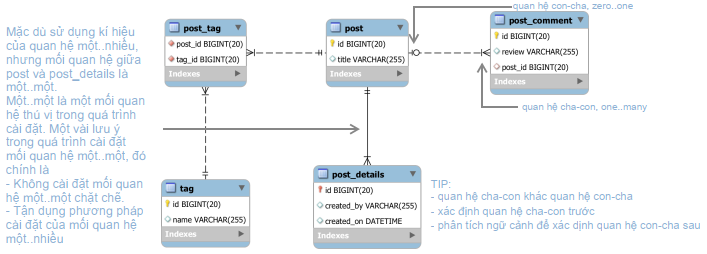

# Spring Data JPA

## Introduction

* This project focuses on Spring Data JPA Specification. A couple of things are going to be investigated as following
  * Main concepts
  * Associations: one-to-one, one-to-many, many-to-many

## [Why shoud we care](https://www.baeldung.com/jpa-vs-jdbc)

* JPA, unlike JDBC, allows developers to construct database-driven Java programs utilizing object-oriented semantics.
* Managing Associations are simpler.
* JPA is database-agnostic, meaning that the same code can be used in a variety of databases with few (or no) modifications.
* The JPA framework uses only unchecked exceptions, like Hibernate. Hence, we don't need to catch or declare them at every place we're using them.
* Professional developers are more than capable of producing Java applications that run equally well regardless of the technology utilized.
* PA serves as a layer of abstraction that hides the low-level JDBC calls from the developer, making database programming considerably easier.
* Transaction management is implicitly provided in JPA.

## Main Concepts

### Association Mapping Constructs

JPA defines **four association mapping constructs**:

* ``@ManyToOne`` represents the **child-side** (where the foreign key resides) in a database one-tomany table relationship
* ``@OneToMany`` is associated with the **parent-side** of a one-to-many table relationship
* ``@OneToOne`` is used for both the child-side and the parent-side in a one-to-one table relationship
* ``@ManyToMany`` mirrors a many-to-many table relationship.

### Native query and JPQL

To be able to query data from DB we can either use native query or JPQL. Native query is just the regular SQL query statement, while JPQL (Java Persistence Querying Language) abstracts the common SQL syntax by subtracting database specific querying features, so it lacks support for Window Functions, Common Table Expressions, Derived tables or PIVOT.

### Transaction Management

Transactions manage the changes that you perform in one or more systems. **The main goal of a transaction is to provide ACID characteristics to ensure the consistency and validity of your data** [[reference](https://thorben-janssen.com/transactions-spring-data-jpa/)].

Spring provides all the boilerplate code that’s required to start, commit, or rollback a transaction. It also integrates with Hibernate’s and JPA’s transaction handling. If you’re using Spring Boot, this reduces your effort to a ``@Transactional`` annotation on each interface, method, or class that shall be executed within a transactional context [[reference](https://thorben-janssen.com/transactions-spring-data-jpa/)].

The ``@Transactional`` annotation **belongs to the Service layer** because it is the Service layer’s responsibility to define the transaction boundaries [[reference]](<https://vladmihalcea.com/spring-transactional-annotation/>).

## Demo

## Source

Source code is not public. It is only available for pair review.

## Motivation

This app is about to manage the blog-posts. To this end, the centerpiece of this app is the post entities. This concept is represented via ``PostJpaEntity``. To serve the purpose of making the architecture be clean, three classes are introduced that can represent the post entities in an appropriate manner at each level.

* ``PostJpaEntity`` at the layer of enetiy (the innermost layer)
* ``Post`` at the layer of service (the middle layer)
* ``PostDto`` at layer of controller (the outermost layer)

## Funtional Requirements

1. **Get all posts**
2. **Get post by id**
3. **Get post by title**
4. **Add a new post**
5. **Add a comment to a post**
6. **Edit a post**
7. **Edit a comment belongs to a post**
8. **Delete a post**
9. **Delete a comment belongs to a post**
10. **Tag a post**
11. **Untag a post**

## Implementation Details

When implementing an app, **database design** with **constraints definition** should be done **beforehand** at **DBMS-side**.



* The ``post`` table has a **one-to-many** relationship with the ``post_comment`` table because a post row might be referenced by multiple comments. The ``post`` is the parent-side while the ``post_comment`` is the child-side.
* The ``post`` table has a **one-to-one** relationship with the ``post_details``.
* The ``post`` and the ``tag`` are both independent tables and neither one is a child of the other. A post can feature several tag(s), while a tag can also be associated with multiple post(s).

### Implementation for ``post`` and ``post_comment``

The best way to map a one-to-many association is to rely on the ``@ManyToOne`` on the child side to propagate all entity state changes, [please refer here](https://vladmihalcea.com/the-best-way-to-map-a-onetomany-association-with-jpa-and-hibernate/).

### Implementation for ``post`` and ``post_details``

From a database perspective, the one-to-one association is based on a foreign key that’s constrained to be unique. ``DEFERABLE`` comes into play!

[The insight into ``DEFERABLE``](https://www.cybertec-postgresql.com/en/1-to-1-relationship-in-postgresql-for-real/)
> This controls whether the constraint can be deferred. A constraint that is not deferrable will be checked immediately after every command. Checking of constraints that are deferrable can be postponed until the end of the transaction (using the SET CONSTRAINTS command). NOT DEFERRABLE is the default. Currently, only UNIQUE, PRIMARY KEY, EXCLUDE, and REFERENCES (foreign key) constraints accept this clause. NOT NULL and CHECK constraints are not deferrable. Note that deferrable constraints cannot be used as conflict arbitrators in an INSERT statement that includes an ON CONFLICT DO UPDATE clause.

The implementation of database could be as following

``` sql
CREATE TABLE post (
 id SERIAL PRIMARY KEY,
 title VARCHAR(1024) NOT NULL
);

CREATE TABLE post_detail(
 id BIGINT PRIMARY KEY,
 created_by VARCHAR(512) NOT NULL UNIQUE,
 created_on TIMESTAMP WITHOUT TIME ZONE DEFAULT (CURRENT_TIMESTAMP AT TIME ZONE 'utc')
);

ALTER TABLE post
 ADD FOREIGN KEY (id) REFERENCES post_detail(id)
  DEFERRABLE INITIALLY DEFERRED;
  
ALTER TABLE post_detail
 ADD FOREIGN KEY (id) REFERENCES post(id)
  DEFERRABLE INITIALLY DEFERRED;
```

For further understanding of one-to-one mapping, please have a look on the section reference.

In practice, I do not follow the aformentioned strict one-to-one setup due to the pain in the ass! By faking the one-to-many association with the constraint of unique on the foreign key, the solution is going to be much more simple. The implemation of data base can become as following

```sql
CREATE TABLE post (
 id SERIAL PRIMARY KEY,
 title VARCHAR(1024) NOT NULL
);

CREATE TABLE post_detail(
 id SERIAL PRIMARY KEY,
 created_by VARCHAR(512) NOT NULL,
 created_on TIMESTAMP WITHOUT TIME ZONE DEFAULT (CURRENT_TIMESTAMP AT TIME ZONE 'utc'),
 post_id BIGINT NOT NULL UNIQUE,
 CONSTRAINT fk_post
  FOREIGN KEY(post_id)
  REFERENCES post(id)
  ON DELETE CASCADE
);
```

### Implementation for ``post`` and ``tag``

The relation between ``post`` and ``tag`` represent the many-to-may association. To model this kind of assiciation, we need to introduce a junction table, so-called ``post_tag``, that should have two foreign keys ``post_id`` and ``tag_id`` that refer to the id fields in ``post`` and ``tag`` respectively.

Now the one-to-many association is going to be leveraged again to implement the many-to-many association.

The implementation of database is as following

```sql
CREATE TABLE post (
 id SERIAL PRIMARY KEY,
 title VARCHAR(1024) NOT NULL

CREATE TABLE tag(
 id SERIAL PRIMARY KEY,
 name VARCHAR(32) NOT NULL UNIQUE
);

CREATE TABLE post_tag(
 id SERIAL PRIMARY KEY,
 post_id BIGINT NOT NULL,
 tag_id BIGINT NOT NULL,
 CONSTRAINT fk_post
  FOREIGN KEY(post_id)
  REFERENCES post(id)
  ON DELETE CASCADE,
 CONSTRAINT fk_tag
  FOREIGN KEY(tag_id)
  REFERENCES tag(id)
  ON DELETE CASCADE
);
```

## References

### one-to-many Association

1. [The best way to implement equals, hashCode, and toString with JPA and Hibernate](https://vladmihalcea.com/the-best-way-to-implement-equals-hashcode-and-tostring-with-jpa-and-hibernate/)
2. [A Comparison Between JPA and JDBC](https://www.baeldung.com/jpa-vs-jdbc)
3. [Learn JPA & Hibernate](https://www.baeldung.com/learn-jpa-hibernate)
4. [The best way to map a @OneToMany relationship with JPA and Hibernate](https://vladmihalcea.com/the-best-way-to-map-a-onetomany-association-with-jpa-and-hibernate/)
5. [https://stackoverflow.com/a/25184489/5657159](https://stackoverflow.com/a/25184489/5657159)
6. <https://stackoverflow.com/a/25202635/5657159>
7. [JPA- Joining two tables in non-entity class](https://stackoverflow.com/questions/25179180/jpa-joining-two-tables-in-non-entity-class/25184489#25184489)

### one-to-one Association

1. [PostgreSQL - One-To-One - which approach is "better"? [closed]](<https://stackoverflow.com/questions/63990708/postgresql-one-to-one-which-approach-is-better>)
2. [1-to-1 relationship in PostgreSQL for real](https://www.cybertec-postgresql.com/en/1-to-1-relationship-in-postgresql-for-real/)
3. [The best way to map a @OneToOne relationship with JPA and Hibernate](https://vladmihalcea.com/the-best-way-to-map-a-onetoone-relationship-with-jpa-and-hibernate/)
4. [What is the most recommended way to store time in PostgreSQL using Java?](https://stackoverflow.com/a/6627999/5657159)
5. <https://dba.stackexchange.com/questions/253429/when-the-primary-key-is-also-the-foreign-key-in-postgres>
6. [Hibernate Tips: How to Share the Primary Key in a One-to-One Association](https://thorben-janssen.com/hibernate-tips-same-primary-key-one-to-one-association/)

### many-to-many Associtation

1. [The best way to map a JPA and Hibernate many-to-many association with extra columns](https://vladmihalcea.com/the-best-way-to-map-a-many-to-many-association-with-extra-columns-when-using-jpa-and-hibernate/)
2. [Many-To-Many Relationship in JPA](https://www.baeldung.com/jpa-many-to-many)
3. [Add unique constraint to combination of two columns](https://stackoverflow.com/questions/15800250/add-unique-constraint-to-combination-of-two-columns)

### Transaction

1. [Managing Transactions with Spring and Spring Data JPA](https://thorben-janssen.com/transactions-spring-data-jpa/)
2. [The best way to use the Spring Transactional annotation](https://vladmihalcea.com/spring-transactional-annotation/)

### Miscleneous

1. [Can someone explain mappedBy in JPA and Hibernate?](https://stackoverflow.com/questions/9108224/can-someone-explain-mappedby-in-jpa-and-hibernate)
2. [Spring Data JPA Update @Query not updating?](https://stackoverflow.com/a/20056058/5657159)
3. [Spring Data JPA @Modifying Annotation](https://www.baeldung.com/spring-data-jpa-modifying-annotation)
4. [The Exists Query in Spring Data](https://www.baeldung.com/spring-data-exists-query)
